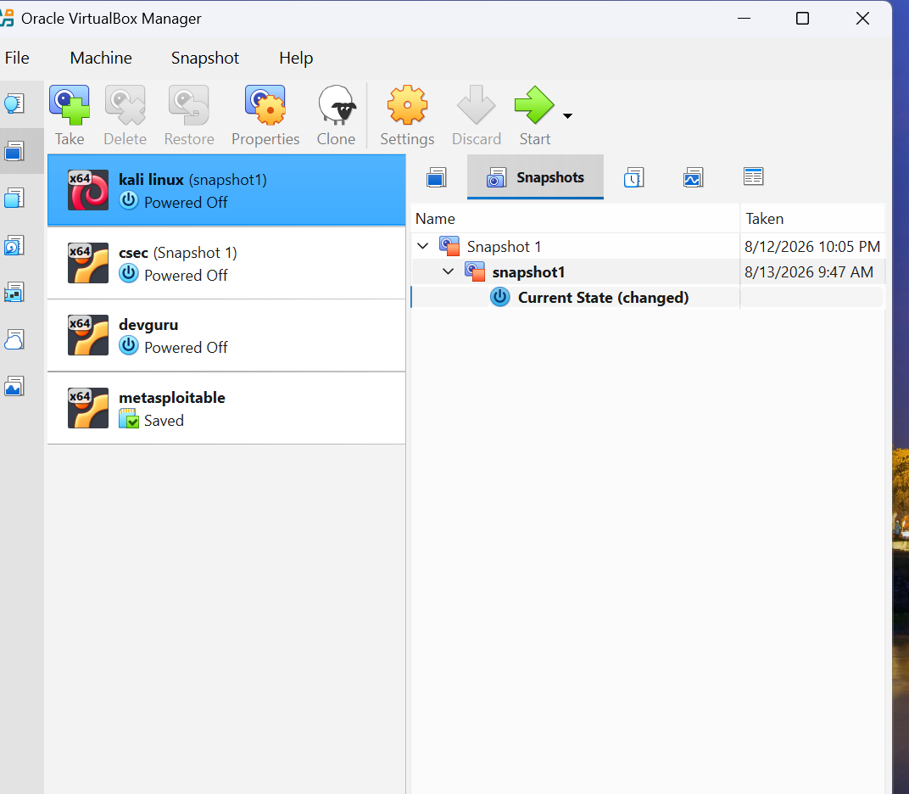

Setting Up a Cybersecurity Lab on My Laptop

Introduction

As part of my cybersecurity training with NetworkWalks, I set up a cybersecurity lab environment on my laptop. The purpose of this lab is to create a safe and controlled environment for practicing cybersecurity concepts and performing hands-on security exercises.

1. Installing VirtualBox

I installed Oracle VirtualBox on my Windows laptop. VirtualBox allows me to create and run virtual machines without affecting my main Windows operating system.

Screenshot: VirtualBox Setup

"VirtualBox Setup" (virtualbox.png)

2. Setting Up Kali Linux

After installing VirtualBox, I created a virtual machine and installed Kali Linux in the VirtualBox environment.

Kali Linux will be used as one of the main tools in my cybersecurity laboratory for security testing and practical exercises.

Configuring the Network

I configured the network settings on my laptop/virtual machine to establish communication within the cybersecurity lab environment.

4. Verifying Kali Linux

After starting Kali Linux, I opened the terminal and used the "whoami" command to verify the current user.

whoami

The command returned the current Kali Linux user, confirming that the Kali Linux environment was running successfully.

Screenshot: Kali Linux "whoami" Verification

"Kali Linux Verification" (whoami.png)

Conclusion

The cybersecurity lab was successfully set up on my laptop using VirtualBox and Kali Linux. This environment provides a controlled space for practicing cybersecurity skills, conducting laboratory exercises, and learning through hands-on experience.
